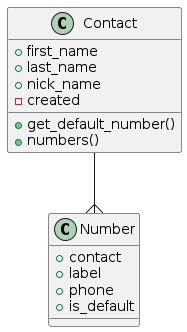

# phonebook
simple phonebook api with FastAPI 
____
this project assumes that user can create a contact and each contact can have several numbers
as you can see in picture: 

## plantUML usage:

first install openJDK : `sudo apt install openjdk-11-jdk`

then

to use plantUML, use `java -jar plantuml.jar uml.txt`

## docs:
- [sqlAlchemy](https://fastapi.tiangolo.com/tutorial/sql-databases/#create-the-sqlalchemy-parts)
- [behave](https://behave.readthedocs.io/en/latest/tutorial/)
- [behave tutorial](http://www.techlistic.com/2023/05/python-behave-tutorial.html)
- [plantUML docs](https://pdf.plantuml.net/PlantUML_Language_Reference_Guide_en.pdf)
- [gherkin docs](https://cucumber.io/docs/gherkin/reference/)