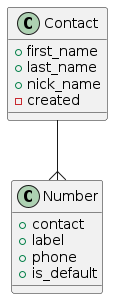

# phonebook
simple phonebook api with FastAPI 
____
this project assumes that user can create a contact and each contact can have several numbers
as you can see in picture: 

## PlantUML usage:

first install openJDK : `sudo apt install openjdk-11-jdk`

then

to use plantUML, use `java -jar plantuml.jar uml.txt`

## Docs:
- [sqlAlchemy](https://fastapi.tiangolo.com/tutorial/sql-databases/#create-the-sqlalchemy-parts)
- [behave](https://behave.readthedocs.io/en/latest/tutorial/)
- [behave tutorial](http://www.techlistic.com/2023/05/python-behave-tutorial.html)
- [good explanation of behave](https://jenisys.github.io/behave.example/intro.html)
- [plantUML docs](https://pdf.plantuml.net/PlantUML_Language_Reference_Guide_en.pdf)
- [gherkin docs](https://cucumber.io/docs/gherkin/reference/)
- [fastapi with docker](https://fastapi.tiangolo.com/deployment/docker/)

### Using Docker 
in order to use docker, you can build this project using `docker build` command:

`docker build -t <what_ever_name_you_want> .`

after building our image is done, you can run a container using our brand-new image by this command:

 `docker run -d --name <container_name> -p 8080:80 <what_ever_name_you_want>`
 
then you can see the running container in http://127.0.0.0.1:8080/docs

that's it! :D 

### keycloak implementation
i've decided to use keycloak as user base since it handles all stuff related to users 
and auth and authorization.

here are some github stuff i found:

- [keycloak with fastapi](https://github.com/code-specialist/fastapi-keycloak)
- [keycloak example](https://fastapi-keycloak.code-specialist.com/full_example/)
- [keycloak example](https://github.com/nurgasemetey/fastapi-keycloak-oidc)

##### how to start it?
you need to use [keycloak docker](https://www.keycloak.org/getting-started/getting-started-docker)

